# Nexora University Copilot


_Nexora - AI-Powered University Communication Ecosystem_

## Project Overview

Nexora is an AI-powered voice chat application ecosystem designed to revolutionize university communication and support. Our comprehensive solution combines real-time voice conversations, intelligent AI agents, and modern web interfaces to create an seamless educational technology platform. Built for the Nexora 1.0 Inter-University Datathon 2025, this project demonstrates advanced AI agent orchestration, real-time communication, and intelligent user interaction capabilities.

The Nexora ecosystem consists of three integrated components working together to provide a complete AI-powered university communication solution.

## System Architecture

Our project is organized into four main repositories, each handling a specific component of the Nexora ecosystem:

### 📱 [Mobile Application](https://github.com/MS-Rex/nexora-app.git)

**Flutter-based AI Voice Chat App**

- Real-time voice conversations with AI agents
- Beautiful animated UI with voice visualizations
- WebSocket communication for instant responses
- Speech recognition and audio processing
- Cross-platform mobile experience (iOS & Android)

### 🤖 [AI Agentic System](https://github.com/MS-Rex/nexora-ai.git)

**Backend AI Engine & Agent Orchestration**

- Intelligent conversation processing
- Voice-to-text and text-to-voice conversion
- AI agent management and coordination
- Machine learning pipeline integration

### 🌐 [Web Application](https://github.com/nilanviduranga/uni-chat-bot.git)

**University Chat Interface**

- University chatbot web interface
- Web-based chat functionality
- Real-time messaging system

### 🎨 [Landing Page](https://github.com/MS-Rex/nexora-landing.git)

**Marketing Platform & Competition Entry**

- Modern Next.js 15 landing page
- Competition showcase and information
- Responsive design with dark/light theme
- Built by Team RexFlow for Nexora 1.0 Datathon

[](https://www.youtube.com/watch?v=l6LxqBMR7uM)

## Features

### Core Features

- **Real-time Voice Chat**: Instant AI-powered voice conversations
- **Cross-platform Mobile App**: Native experience on iOS and Android
- **Intelligent AI Agents**: Advanced conversation processing and responses
- **Web Chat Interface**: Browser-based chatbot for universities
- **WebSocket Communication**: Real-time bidirectional data exchange
- **Speech Recognition**: Advanced voice-to-text capabilities
- **Voice Synthesis**: Natural AI voice responses

### Additional Features

- **Beautiful Animations**: Dynamic voice wave patterns and breathing effects
- **Multi-platform Support**: Mobile, web, and backend integration
- **Secure Communication**: Encrypted real-time data transmission
- **User Authentication**: Secure user management system
- **Chat History**: Persistent conversation storage
- **Permission Management**: Granular device permission control

## Tech Stack

### Mobile Frontend (Flutter App)

- **Frontend**: Flutter 3.29.1, Dart, Material Design 3
- **State Management**: BLoC Pattern, Injectable DI
- **Navigation**: Auto Route
- **Audio**: Record Package, AudioPlayers
- **Communication**: WebSocket, JSON

### Backend (AI Agentic System)

- **Backend**: Laravel (PHP framework)
- **Real-time Communication**: Pusher (WebSocket service)
- **Authentication & Authorization**: Spatie Laravel Permission (Role management)
- **Database**: MySQL
- **AI/ML**: OpenAI Whisper (Small model - 244M parameters)
- **Voice Processing**: OpenAI Whisper for speech recognition and transcription
- **Communication**: WebSocket Gateway, REST APIs

### Web Application

- **Frontend**: Next.js (React-based framework)
- **Backend**: Laravel (PHP framework)
- **Database**: MySQL

## Live Infrastructure

Our complete Nexora ecosystem is deployed and running live on AWS cloud infrastructure:

### AWS Architecture

- **🖥️ EC2 Instance 1**: Laravel backend server
- **🖥️ EC2 Instance 2**: FastAPI AI processing server
- **🗄️ Amazon RDS**: Managed relational database service
- **📊 Sentry**: Real-time error tracking and performance monitoring
- **🌐 Load Balancing**: Distributed across multiple availability zones

### Monitoring & Operations

- **Error Tracking**: Sentry integration for real-time error monitoring
- **Performance Monitoring**: Application performance insights and alerting
- **Database Management**: Amazon RDS for scalable and reliable data storage
- **Auto-scaling**: EC2 instances configured for dynamic scaling based on demand

**🚀 Live Demo**: [https://nexora-chat.vercel.app/](https://nexora-chat.vercel.app/)

## Screenshots/Demo

### Mobile Application Demo


_Mobile app UI design created in Figma showcasing the voice chat interface and animations_

<table>
<tr>
<td width="50%">

<p align="center"><em>Nexora mobile app home screen showing the clean and intuitive user interface</em></p>
</td>
<td width="50%">

<p align="center"><em>Active voice chat mode with real-time voice visualization and AI interaction interface</em></p>
</td>
</tr>
</table>

_Additional screenshots and demo videos available in the [mobile app repository](https://github.com/MS-Rex/nexora-app.git)_

### Web Application Demo


_Nexora web application home page featuring the university chatbot interface built with Next.js_

_Additional screenshots and demo videos available in the [web app repository](https://github.com/nilanviduranga/uni-chat-bot.git)_

### Overall System Architecture


_Complete Nexora ecosystem architecture diagram showing all components and their interactions_

```mermaid
flowchart TD
    %% Users Layer
    MobileUser["📱 Mobile User<br/>(Flutter App)"]
    WebUser["🌐 Web User<br/>(Next.js)"]

    %% Frontend Layer
    subgraph Frontend["Frontend Layer"]
        Mobile["📱 Mobile App<br/>Flutter 3.29.1<br/>• BLoC State Management<br/>• Auto Route Navigation<br/>• Material Design 3<br/>• WebSocket Client<br/>• Audio Recording"]
        Web["🌐 Web Application<br/>Next.js<br/>• React Framework<br/>• University Chat Interface<br/>• Landing Pages<br/>• Responsive Design"]
    end

    %% Communication Layer
    subgraph Communication["Communication Layer"]
        WebSocket["📡 WebSocket<br/>Pusher Service<br/>• Real-time messaging<br/>• Voice data streaming<br/>• Connection management"]
        RestAPI["🔗 REST APIs<br/>Laravel Endpoints<br/>• Authentication<br/>• Data operations<br/>• File uploads"]
    end

    %% Backend Services
    subgraph Backend["Backend Services Layer"]
        Laravel["🛠️ Laravel Backend<br/>EC2 Instance 1<br/>• User Authentication<br/>• Spatie Permissions<br/>• Chat Management<br/>• API Gateway"]
        FastAPI["🤖 FastAPI AI Server<br/>EC2 Instance 2<br/>• Voice Processing<br/>• AI Agent Orchestration<br/>• OpenAI Whisper Integration<br/>• ML Pipeline"]
    end

    %% AI/ML Layer
    subgraph AI["AI/ML Processing"]
        Whisper["🎤 OpenAI Whisper<br/>Small Model (244M)<br/>• Speech-to-Text<br/>• Language Detection<br/>• Audio Transcription"]
        AIAgent["🧠 AI Agents<br/>• Conversation Processing<br/>• Response Generation<br/>• Context Management"]
    end

        %% Data Layer
    subgraph Data["Data Layer"]
        MySQL["🗄️ MySQL Database<br/>Amazon RDS<br/>• User Data<br/>• Chat History<br/>• Authentication<br/>• Analytics<br/>• Voice Transcriptions"]
    end

    %% Infrastructure Layer
    subgraph Infrastructure["AWS Infrastructure"]
        LoadBalancer["⚖️ Load Balancer<br/>• Traffic Distribution<br/>• High Availability<br/>• Auto-scaling"]
    end

    %% External Services
    subgraph External["External Services"]
        Sentry["📊 Sentry Monitoring<br/>• Error Tracking<br/>• Performance Metrics<br/>• Real-time Alerts<br/>• Application Monitoring"]
    end

    %% User Connections
    MobileUser --> Mobile
    WebUser --> Web

    %% Frontend to Communication
    Mobile --> WebSocket
    Mobile --> RestAPI
    Web --> RestAPI

    %% Communication to Backend
    WebSocket --> Laravel
    RestAPI --> Laravel

    %% Backend Connections
    Laravel --> MySQL
    Laravel --> FastAPI
    FastAPI --> Whisper
    FastAPI --> AIAgent
    FastAPI --> MySQL

        %% Infrastructure Connections
    LoadBalancer --> Laravel
    LoadBalancer --> FastAPI

    %% External Service Connections
    Sentry --> Laravel
    Sentry --> FastAPI

    %% Styling
        classDef userLayer fill:#e3f2fd,stroke:#1976d2,stroke-width:2px
    classDef frontendLayer fill:#f3e5f5,stroke:#7b1fa2,stroke-width:2px
    classDef commLayer fill:#e8f5e8,stroke:#388e3c,stroke-width:2px
    classDef backendLayer fill:#fff3e0,stroke:#f57c00,stroke-width:2px
    classDef aiLayer fill:#fce4ec,stroke:#c2185b,stroke-width:2px
    classDef dataLayer fill:#f1f8e9,stroke:#689f38,stroke-width:2px
    classDef infraLayer fill:#f5f5f5,stroke:#616161,stroke-width:2px
    classDef externalLayer fill:#fff8e1,stroke:#ff8f00,stroke-width:2px

    class MobileUser,WebUser userLayer
    class Mobile,Web frontendLayer
    class WebSocket,RestAPI commLayer
    class Laravel,FastAPI backendLayer
    class Whisper,AIAgent aiLayer
    class MySQL dataLayer
    class LoadBalancer infraLayer
    class Sentry externalLayer
```

<details>
<summary>📊 Interactive Architecture Diagram (Click to expand)</summary>



</details>

_Complete Nexora ecosystem architecture showing the integration of mobile app, web application, AI processing, and AWS infrastructure_

## Setup Instructions

To run the complete Nexora ecosystem locally, you'll need access to several external services and APIs. Follow the setup instructions for each component:

### Prerequisites & External Services

Before setting up the local environment, ensure you have access to the following services:

#### Required API Keys & Services:

- **🤖 OpenAI API**: Required for AI conversation processing and language models
- **📊 Logfire API**: Required for advanced logging and monitoring
- **📈 Sentry API**: Required for error tracking and performance monitoring
- **☁️ AWS RDS URL**: Required for database connectivity (alternatively, set up local MySQL)
- **🎤 OpenAI Whisper Model**: Can be run locally (Small model - 244M parameters)

#### Environment Variables:

Create `.env` files in each repository with the following required variables:

```bash
# OpenAI Configuration
OPENAI_API_KEY=your_openai_api_key_here

# Logfire Configuration
LOGFIRE_API_KEY=your_logfire_api_key_here

# Sentry Configuration
SENTRY_DSN=your_sentry_dsn_here

# Database Configuration
AWS_RDS_URL=your_aws_rds_connection_string
# OR for local development:
DB_CONNECTION=mysql
DB_HOST=127.0.0.1
DB_PORT=3306
DB_DATABASE=nexora_local
DB_USERNAME=your_username
DB_PASSWORD=your_password

# Pusher Configuration (for WebSocket)
PUSHER_APP_ID=your_pusher_app_id
PUSHER_KEY=your_pusher_key
PUSHER_SECRET=your_pusher_secret
```

### If you Love be Alpha tester on Production Application use below credentials to login (Its not fully functional due limited resources and time but soon will be full update to latest code)

Email : test-user@nexora.com
OTP : 123456

### Local Development Setup

To run the complete Nexora ecosystem locally, follow the setup instructions for each component:

### 1. Mobile Application Setup

```bash
# Clone the mobile app repository
git clone https://github.com/MS-Rex/nexora-app.git
cd nexora-app

# Install Flutter dependencies
flutter pub get

# Generate required files
dart run build_runner build --delete-conflicting-outputs

# Run the mobile application
flutter run
```

### 2. AI Agentic System Setup

```bash
# Clone the AI system repository
git clone https://github.com/MS-Rex/nexora-ai.git
cd nexora-ai

# [Placeholder: Installation instructions]
# Follow setup instructions in the AI system repository
```

### 3. Web Application Setup

```bash
# Clone the web app repository
git clone https://github.com/nilanviduranga/uni-chat-bot.git
cd uni-chat-bot

# [Placeholder: Installation instructions]
# Follow setup instructions in the web application repository
```

### Alternative Local Setup (Without External Services)

If you prefer to run everything locally without external dependencies:

#### Local MySQL Setup:

```bash
# Install and configure local MySQL
sudo apt-get install mysql-server  # Ubuntu/Debian
brew install mysql                 # macOS

# Create local database
mysql -u root -p
CREATE DATABASE nexora_local;
```

#### Local Whisper Setup:

```bash
# Install OpenAI Whisper locally
pip install openai-whisper

# Download the small model (244M parameters)
whisper --model small --download-root ./models
```

#### Minimal Environment Configuration:

For basic local development, you can use minimal configuration:

```bash
# Minimal .env for local development
DB_CONNECTION=mysql
DB_HOST=127.0.0.1
DB_DATABASE=nexora_local
WHISPER_MODEL_PATH=./models/small.pt
```

Refer to the individual repository README files for component-specific configuration details and additional setup options.

## Repository Links

| Component     | Repository                                                         | Description                                    |
| ------------- | ------------------------------------------------------------------ | ---------------------------------------------- |
| 📱 Mobile App | [nexora-app](https://github.com/MS-Rex/nexora-app.git)             | Flutter-based AI voice chat mobile application |
| 🤖 AI System  | [nexora-ai](https://github.com/MS-Rex/nexora-ai.git)               | Backend AI engine and agent orchestration      |
| 🌐 Web App    | [uni-chat-bot](https://github.com/nilanviduranga/uni-chat-bot.git) | Web interface and landing page                 |

## Team

- **Team Member 1** – AI/ML & Mobile Developer & Project Lead
- **Team Member 2** – AI/ML Engineer & Backend Developer
- **Team Member 3** – Web Developer & Frontend Developer
- **Team Member 4** – UI/UX Designer & API Integration Specialist

_Team RexFlow - Where AI meets innovation and data fuels transformation!_

## Documentation

- **Mobile App Documentation**: Available in [nexora-app repository](https://github.com/MS-Rex/nexora-app.git)
- **AI System Documentation**: Available in [nexora-ai repository](https://github.com/MS-Rex/nexora-ai.git)
- **Web App Documentation**: Available in [uni-chat-bot repository](https://github.com/nilanviduranga/uni-chat-bot.git)

## Competition Details

**🏆 Nexora 1.0 Inter-University Datathon 2025**

This project represents a complete AI-powered university communication ecosystem, showcasing:

- Advanced AI agent orchestration
- Real-time voice and text communication
- Cross-platform mobile and web applications
- Intelligent conversation processing
- Modern UI/UX design principles

**Prizes:** 🥇 LKR 50,000 | 🥈 LKR 30,000 | 🥉 LKR 20,000

## Submission

**Developed for Nexora 1.0 – Round 2**  
**Submission Date**: 12th June 2025

**Live Demo**: https://nexora-chat.vercel.app/
**Project Website**: [nexora.msanjana.com](https://nexora.msanjana.com/)

---

## Contact & Support

- 📧 **Email**: miyurusanjana@gmail.com
- 🌐 **Website**: https://nexora-chat.vercel.app/
- 💬 **Issues**: Use the individual repository issue trackers

---

**Made with ❤️ by Team RexFlow**  
_Transforming university communication through AI-powered innovation_
